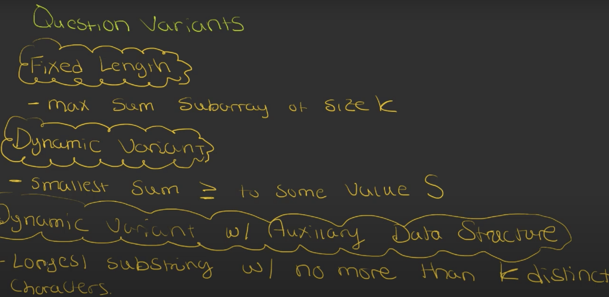

# Sliding Window

## Types of Sliding Window:

1. Fast & Slow (slow pointer moves incrementally independently to the fast based on a condition)
   - LongestSubstringWithoutRepeatingCharacters_LC3
   - MinimumWindowSubstring_LC76
   - LongestSubstringWithAtMostTwoDistinctChars_LC159
   - LongestSubstringWithAtMostKDistinctCharacters_LC340
   - LongestRepeatingCharacterReplacement_LC424
   - FindAllAnagramsInAString_LC438
2. Fast & Catch up (slow pointer jumps & resets independently to the fast based on a condition)
   - SubstringWithConcatenationOfAllWords_LC30
3. Fast & Lagging (slow pointer moves along with the fast based on a constant window size)
   - PermutationsInAString_LC567
4. Front & Back

## Sliding Window Template - 1
**https://leetcode.com/problems/find-all-anagrams-in-a-string/discuss/92007/sliding-window-algorithm-template-to-solve-all-the-leetcode-substring-search-problem**

### Steps
1. Have a counter and/or hash-map to count specific array input
2. two pointers - begin, end.
3. outer for end until the end of the string / array.
4. inner while loop for moving begin;
   as long as either window condition and/or another condition is satisfied / not satisfied. - move the begin pointer.
5. Check the minimum/max/find result.

### Code Example

```java
public class LongestSubstringWithAtMostKDistinctCharacters_LC340 {
   public int lengthOfLongestSubstringKDistinct(String s, int k) {
      HashMap<Character, Integer> map = new HashMap<>();
      int begin = 0;
      int result = 0;
      int counter = 0;
      for (int end = 0; end < s.length(); end++) {
         char c = s.charAt(end);
         map.put(c, map.getOrDefault(c, 0) + 1);
         if (map.get(c) == 1)
            counter++;

         while (counter > k) {
            char beginC = s.charAt(begin);
            map.put(beginC, map.get(beginC) - 1);
            if (map.get(beginC) == 0) {
               counter--;
            }
            begin++;
         }
         // update max
         result = Math.max(end - begin + 1, result);
      }
      return result;
   }
}
```
### Problems
- LC 3 - https://leetcode.com/problems/longest-substring-without-repeating-characters/
- LC 30 - https://leetcode.com/problems/substring-with-concatenation-of-all-words/
- LC 76 - https://leetcode.com/problems/minimum-window-substring/
- LC 159 - https://leetcode.com/problems/longest-substring-with-at-most-two-distinct-characters/
- LC 340 - https://leetcode.com/problems/longest-substring-with-at-most-k-distinct-characters/
- LC 424 - https://leetcode.com/problems/longest-repeating-character-replacement/
- LC 438 - https://leetcode.com/problems/find-all-anagrams-in-a-string/
- LC 567 - https://leetcode.com/problems/permutation-in-string/description/

## Sliding Window Template - 2
**https://leetcode.com/discuss/study-guide/657507/Sliding-Window-for-Beginners-Problems-or-Template-or-Sample-Solutions**
- LC 209 - https://leetcode.com/problems/minimum-size-subarray-sum/
- LC 239 - https://leetcode.com/problems/sliding-window-maximum/
- LC 424 - https://leetcode.com/problems/longest-repeating-character-replacement/
- LC 862 - https://leetcode.com/problems/shortest-subarray-with-sum-at-least-k/
- LC 904 - https://leetcode.com/problems/fruit-into-baskets/
- LC 992 - https://leetcode.com/problems/subarrays-with-k-different-integers/
- LC 1004 - https://leetcode.com/problems/max-consecutive-ones-iii/
- LC 1208 - https://leetcode.com/problems/get-equal-substrings-within-budget/
- LC 1234 - https://leetcode.com/problems/replace-the-substring-for-balanced-string/
- LC 1248 - https://leetcode.com/problems/count-number-of-nice-subarrays/
- LC 1358 - https://leetcode.com/problems/number-of-substrings-containing-all-three-characters/
- LC 1438 - https://leetcode.com/problems/longest-continuous-subarray-with-absolute-diff-less-than-or-equal-to-limit/


## Things to worry about
1. If calculating a sum - always use a double
2. corner cases are very important - left < right, left <= right, left <= 0, right >= len - 1 etc.,

## Reading links
1. https://leetcode.com/discuss/study-guide/657507/Sliding-Window-for-Beginners-Problems-or-Template-or-Sample-Solutions
2. https://medium.com/outco/how-to-solve-sliding-window-problems-28d67601a66
3. https://leetcode.com/problems/find-all-anagrams-in-a-string/discuss/92007/sliding-window-algorithm-template-to-solve-all-the-leetcode-substring-search-problem

## Example Image link

