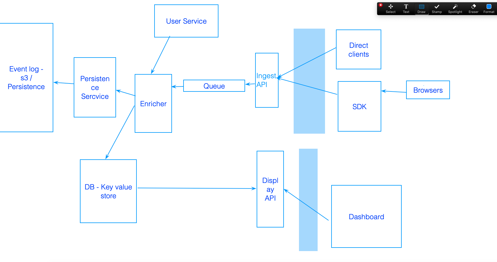

# Round 1

Input Json with employee details - Group by department and sum of salaries.
-- then find median, mean.
Objected oriented design.
unit tests.

# Round 2 - Hiring manager

Met with director. Product walkthrough and features.

# Round 3 - Onsite
1. Coding / Algo  (manager)- Design paint canvas with shapes - rectangles, square.
Add shapes. Display, Change start point, display - linked hashmap, shape object.

2. System design (engineer)
   

3. Coding / algo (engineer)
```java
// Company xyz.com has an organizational structure such that each employee in the company
// can have at most one manager and may have many subordinates.  
// The company recently conducted their quarterly performance
// review cycle and each employee has received a performance rating.

// An example structure is as follows
//       A(5)

// B(3)       C(2)

//         D(4)      E(10)


// Where employee A has rating 5 and direct subordinates B, C.
// Employee B has rating 3 and no direct subordinates. Employee C has rating 2 and two direct subordinates D, E each with rating 4 and 10 respectively.
// Note that although employee D is also a subordinate of employee A, the relationship is not direct.

// Level 0 - Employee data structure

// Provide a data structure for Employee that uniquely identifies the employee,
// their relation with manager and subordinates and has their performance rating.

/* Level 1
For a company meeting, you are tasked with inviting employees such that the total sum of ratings of employees invited is maximum.
You have only one constraint - You cannot invite immediate/direct manager or immediate/direct subordinates of an invited employee.
Please return the total sum of ratings of the invited employees

Input: provided for ease of understanding as a tree structure below

(For the below example, all the employees have the same rating value of 1.)

                 A. - 1 
            B  C  D  E - 3
          F             G  H - 3 
       I    J                K L M N O - 
P Q   R S


Output:13

A sample invite list would look like this [B,C,D,E,  K,L,M,N,O,  P,Q,R,S]
*/

import java.io.*;
import java.util.*;

class MyCode {

static class Employee {
private String name;
private int rating;
public List<Employee> subordinates;

    public Employee(String name, int rating){
      this.name = name;
      this.rating = rating;
      this.subordinates = new ArrayList<>();
    }
    public String getName(){
      return this.name;
    }
    
    public int getRating(){
      return this.rating;
    }
    
    public void addEmployee(Employee e){
      this.subordinates.add(e);
    }
    
    public List<Employee> getSubordinates(){
      return this.subordinates;
    }
}

static int maxRating = Integer.MIN_VALUE;

public static int getMaxRatingEmployees(Employee e){
maxRating = Integer.MIN_VALUE;
// dont choose the root.
visit(e, true, 0);

    // choose the root
    int ratingLevel = e.getRating();
    maxRating = Math.max(maxRating, ratingLevel);
    for (Employee sub : e.getSubordinates()){
      visit(sub, false, ratingLevel);
    }
    return maxRating;
}

// NEED bottom UP with memoization.
    
public static int visit(Employee e, boolean chooseCurrent){
if (chooseCurrent) {
// choose the level
int ratingLevel = 0;
for (Employee sub : e.getSubordinates()){
ratingLevel = ratingLevel + sub.getRating();
}
if ( sum + ratingLevel >= maxRating){
System.out.println(e.getName() + " sum :" + (sum + ratingLevel));
}
maxRating = Math.max(maxRating, sum + ratingLevel);
for (Employee sub : e.getSubordinates()){
visit(sub, false, sum + ratingLevel);
}

    } else {
       // dont choose the level.
       if ( sum >= maxRating){
        System.out.println(e.getName() + " sum :" + sum);
      }
       maxRating = Math.max(maxRating, sum);
       
       visit(e, true, sum);
    } 
}

	public static void main (String[] args) {
		//       A(5)

// B(3)       C(2)

//         D(4)      E(10)
/**
Employee A = new Employee("A", 5);
Employee B= new Employee("B", 3);
Employee C = new Employee("C", 2);
Employee D = new Employee("D", 4);
Employee E = new Employee("E", 10);

    A.subordinates.add(B);
    A.subordinates.add(C);
    C.subordinates.add(D);
    C.subordinates.add(E);
    System.out.println(getMaxRatingEmployees(A)); */
    
    Employee A = new Employee("A", 1);
    Employee B= new Employee("B", 1);
    Employee C = new Employee("C", 1);
    Employee D = new Employee("D", 1);
    Employee E = new Employee("E", 1);
    
    Employee F = new Employee("F", 1);
    Employee G= new Employee("G", 1);
    Employee H = new Employee("H", 1);
    Employee I = new Employee("I", 1);
    Employee J = new Employee("J", 1);
    
    Employee K = new Employee("K", 1);
    Employee L = new Employee("L", 1);
    Employee M = new Employee("M", 1);
    Employee N = new Employee("N", 1);
    Employee O = new Employee("O", 1);
    
    Employee P = new Employee("P", 1);
    Employee Q= new Employee("Q", 1);
    Employee R  = new Employee("R", 1);
    Employee S = new Employee("S", 1);
    
    A.subordinates.add(B);
    A.subordinates.add(C);
    A.subordinates.add(D);
    A.subordinates.add(E);
    
    B.subordinates.add(F);
    F.subordinates.add(I);
    F.subordinates.add(J);
    
    I.subordinates.add(P);
    I.subordinates.add(Q);
    
    J.subordinates.add(R);
    J.subordinates.add(S);
    
    
    E.subordinates.add(G);
    E.subordinates.add(H);
    
    H.subordinates.add(K);
    H.subordinates.add(L);
    H.subordinates.add(M);
    H.subordinates.add(N);
    H.subordinates.add(O);
    
    System.out.println(getMaxRatingEmployees(A));
	}
}
```
